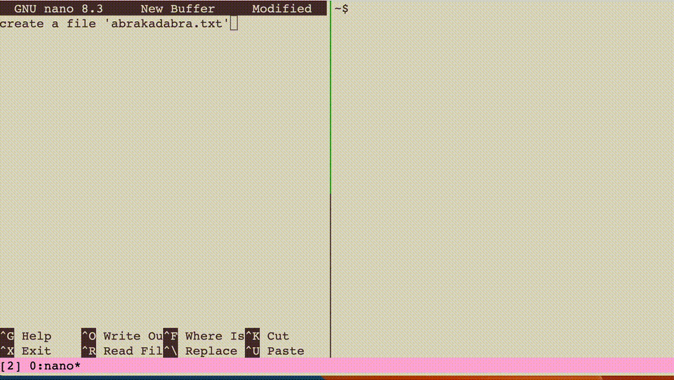

# tmux-completion

A tmux plugin that provides emacs-style word completion with cycling functionality, similar to `Alt+/` in emacs.



## Features

- **Word completion**: Complete partial words by searching through all panes
- **Cycling**: Press the completion key multiple times to cycle through matches  
- **Scrollback support**: Option to search through entire scrollback history
- **Path component extraction**: Handles both full paths and individual components

## Installation

1. Clone this repository:
   ```bash
   git clone https://github.com/machacd/tmuy ~/.tmux/plugins/tmuy
   ```

2. Add this line to your `~/.tmux.conf`:
   ```bash
   run-shell ~/.tmux/plugins/tmuy/tmux-completion.tmux
   ```

3. Reload tmux configuration:
   ```bash
   tmux source-file ~/.tmux.conf
   ```

## Usage

### Default Key Bindings

- **`prefix + /`** - Complete word using visible pane content
- **`prefix + ?`** - Complete word using entire scrollback history (larger word pool)

### How It Works

1. Type a partial word (e.g., `test`)
2. Press the completion key (e.g., `prefix + /`)
3. The word completes to the first match (e.g., `testing_function`)
4. Press the completion key again to cycle to the next match (e.g., `test_variable`)
5. Continue cycling through all available matches

## Configuration

### Custom Key Bindings

You can customize the key bindings by setting these options in your `~/.tmux.conf`:

```bash
# Change the basic completion key (default: "/")
set -g @completion_key "/"

# Change the scrollback completion key (default: "?") 
set -g @completion_scrollback_key "?"
```

## Word Matching

The plugin searches for words that:
- Contain alphanumeric characters, underscores, dots, slashes, and hyphens
- Are at least 2 characters long
- Start with your typed partial word

It extracts both:
- **Full paths**: `/home/user/file.txt`
- **Components**: `home`, `user`, `file`, `txt`

## Performance

- **Visible content**: Fast, searches only currently visible pane content
- **Scrollback content**: Slower but comprehensive, searches entire history

## Requirements

- tmux 2.0+
- bash
- Standard Unix utilities (grep, sed, awk)

## License

MIT License - see [LICENSE](LICENSE) file for details.

## Contributing

1. Fork the repository
2. Create a feature branch
3. Make your changes
4. Add tests if applicable  
5. Submit a pull request

## Troubleshooting

### Completion not working
- Check that the key bindings are loaded: `tmux list-keys | grep completion`
- Verify the plugin is installed correctly
- Try reloading tmux configuration: `tmux source-file ~/.tmux.conf`

### Performance issues
- Use regular completion (`prefix + /`) instead of scrollback completion for better performance
- Consider clearing old scrollback: `tmux clear-history`

### No matches found
- Ensure there are matching words in your panes
- Try typing more characters of the word
- Check that panes contain the expected content

## TODO

- [ ] Show word search time in the status bar